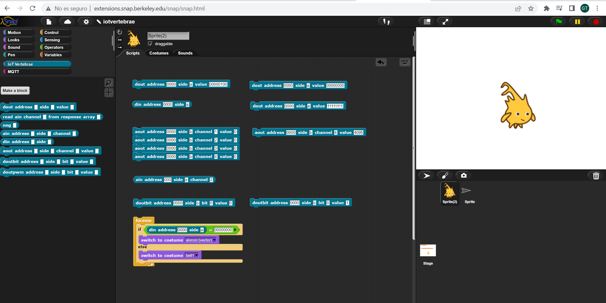

# IoT Vertebrae 

The vertebrae bus is an extenxion of the [UEXT](https://www.olimex.com/Products/Modules/UEXT) open bus proposed by Olimex.

This project will be provided as open-source hardware.

## [Using IoT Vertebrae](https://provisional-binefa-com.translate.goog/index.php/IoT-Vertebrae?_x_tr_sl=ca&_x_tr_tl=en&_x_tr_hl=es&_x_tr_pto=wapp)

